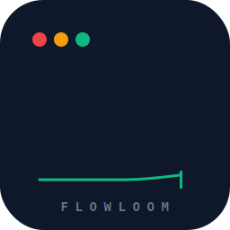

<p align="center">
  
</p>

# DeepSeek FlowLoom

**An open-source, DeepSeek-native agentic coding CLI — rivaling Claude Code at a fraction of the cost.**

[](https://nodejs.org)
[](https://github.com/Renn-rpg/deepseek-flowloom)
[](LICENSE)
[](CONTRIBUTING.md)

> 🌐 English → this document ｜ **中文** → [README.zh-CN.md](README.zh-CN.md)

DeepSeek FlowLoom (`floom`) is a terminal-based coding agent purpose-built for the **DeepSeek API**. It reads, writes, edits files, runs shell commands, and orchestrates **multi-agent workflows** — all from your terminal. Think of it as Claude Code, but native to DeepSeek and fully open source.

```
$ floom "Add unit tests for the auth module"

  → reads src/auth.ts
  → writes src/auth.test.ts
  → runs npm test
  → fixes a failing assertion
  ✅ Done. 3 tools called, 1,247 tokens used.
```

---

## Why FlowLoom?

| | Claude Code | FlowLoom |
|---|---|---|
| Model | Claude (Anthropic API) | **DeepSeek** (OpenAI-compatible) |
| Price | $15/M tokens (Claude) | **Significantly cheaper** — see [DeepSeek pricing](https://api-docs.deepseek.com/quick_start/pricing) |
| Max context | 200K | DeepSeek context TBD — see [fact check](docs/deepseek-fact-check.md#核验表) |
| Workflow engine | Dynamic Workflow | **Dynamic Workflow** (Turing-complete) |
| Open source | ❌ | ✅ MIT |
| Prefix caching | ✅ | ✅ Auto (DeepSeek built-in) |

---

## Quick Start

```bash
# Prerequisites: Node.js >= 24
node --version  # v24.15.0+

# Install
git clone https://github.com/Renn-rpg/flowloom.git
cd flowloom
npm install && npm run build

# Set your DeepSeek API key
echo "DEEPSEEK_API_KEY=sk-your-key-here" > .env

# Your first task
npm run dev -- "Read package.json and summarize this project"

# Interactive mode
npm run dev
```

**No native modules, no node-gyp, no Visual Studio required.**

### 30-Second Demo

```bash
# Run the built-in audit workflow
$ floom run scripts/examples/audit.mjs --sandbox vm --budget 200000

[phase] Discovery
  Scanning project structure...

[phase] Audit
  Found files to audit. Starting parallel review...
  Audit complete. 3/3 files reviewed.

[usage] budget=193957/200000 live=4 cached=0
{
  "filesReviewed": 3,
  "results": [
    "Missing error handling: workflow-runtime.ts silent catch {...},
     potential null dereference at priorCalls[seq]...",
    "No missing .js extensions found in imports...",
    "All imports correctly use .js extension pattern..."
  ]
}
```

The workflow spawns **4 agents in parallel**: one discovers files, three audit them simultaneously. Token cost: ~194K tokens (~$0.05 at DeepSeek pricing).

---

## Features

### 🧠 Agentic Coding Loop

```
floom> Find all TODOs in the codebase and create GitHub issues for each
```

FlowLoom iterates: reads files → finds TODOs → calls GitHub API → reports. Multi-turn loop with up to 25 iterations per turn.

### 🔧 Built-in Tools

| Tool | Description |
|---|---|
| `read_file` | Read UTF-8 text files |
| `write_file` | Write files (auto-creates directories) |
| `edit_file` | Exact, unique string replacement |
| `multi_edit` | Several exact replacements in one file, applied in order |
| `run_shell` | Execute shell commands (pwsh on Windows, bash elsewhere); `background:true` for long-running ones |
| `bash_output` | Read new output from a [background](docs/background-tasks.md) shell |
| `kill_shell` | Stop a background shell |
| `glob` | Find files by name pattern |
| `grep` | Search file contents (ripgrep-style regex) |
| `web_fetch` | Fetch a URL and read it as text/markdown |
| `dispatch_agent` | Delegate a self-contained subtask to an isolated [sub-agent](docs/subagents.md) |

Plus **MCP tools**: connect external [Model Context Protocol](docs/mcp.md) servers via `.floom/mcp.json` and their tools appear to the agent as `mcp__<server>__<tool>`.

### 🔄 Dynamic Workflow Engine

Write **JavaScript workflow scripts** that orchestrate multiple agents:

```js
// audit.mjs
export const meta = { name: 'security-audit', schemaVersion: 1 }

export async function run(ctx) {
  ctx.phase('Scanning')
  const files = await ctx.agent('List all source files in src/')

  ctx.phase('Auditing')
  const results = await ctx.parallel(
    files.split('\n').map(f => () =>
      ctx.agent(`Audit ${f} for SQL injection, XSS, and auth bypass`)
    )
  )

  ctx.log(`Audited ${results.filter(Boolean).length} files`)
  return results
}
```

```bash
floom run audit.mjs --budget 500000 --sandbox vm
```

**Workflow DSL primitives:**
- `agent(prompt, opts?)` — spawn a sub-agent
- `parallel(thunks)` — run thunks concurrently
- `pipeline(items, ...stages)` — process items through stages
- `phase(title)` / `log(msg)` — progress output
- `budget` — token cost tracking and limits
- `workflow(name, args?)` — run a sub-workflow script (one level of nesting)

### ⚡ Streaming & Responsiveness

Real-time token streaming. Answers are rendered as **Markdown** in the terminal (headings, lists, blockquotes, emphasis) with **syntax-highlighted code blocks**. Type **`@`** to pop a file/dir picker and reference a path inline (`@src/cli.ts`). Press **`ESC`** any time during a response to interrupt the current turn and get the prompt back; `Ctrl-O` expands collapsed details.

### 🛡️ Production Hardening

- **Exponential backoff retry** — 429/5xx/network errors, configurable
- **Per-request timeout** — default 60s, prevents hanging
- **Token budget enforcement** — hard cap with pre-check, `BudgetExhaustedError`
- **Concurrency limiter** — Semaphore defaulting to `max(1, min(16, cores-2))` (floors at 1)
- **Agent count cap** — 1000 per workflow

### 📊 Cost Visibility

Every turn prints token usage to stderr:

```
[usage] in=7536 out=394 cacheHit=4736
```

DeepSeek's **automatic prefix caching** is detected and reported, so you know exactly how much you save.

### 🔒 Tool Hooks (PreToolUse)

Control what the agent can do **before it happens** — gate every tool call with allow/deny/ask decisions:

```json
// .floom/hooks.json
{
  "hooks": [
    { "pattern": "run_shell", "decision": "ask", "note": "confirm dangerous commands" },
    { "pattern": "edit_file", "decision": "allow" },
    { "pattern": "glob|grep|web_fetch|read_file", "decision": "allow" }
  ]
}
```

Each hook is a regex-matched decision: `allow` (pass through silently), `deny` (block with a reason), or `ask` (prompt the user to approve/deny). Hooks compose with Plan Mode — when plan mode is active, mutating tools are read-only regardless of hook rules.

See [docs/hooks.md](docs/hooks.md) for the full reference.

### 💾 Deterministic Resume

Workflow runs are journaled to SQLite. **Identical script + args = 100% cache hit**:

```bash
$ floom run audit.mjs              # live=5, cached=0
$ floom run audit.mjs              # live=0, cached=5 ← instant!
```

### 🏖️ Sandboxed Execution

```
$ floom run script.mjs --sandbox vm
```

The `vm` sandbox blocks non-deterministic APIs (`Date.now()`, `Math.random()`, `new Date()` without args), ensuring reproducible workflow runs.

### 🔒 Workspace Isolation

Every workflow run gets a temporary directory. File operations stay inside. Absolute paths and `../` escape attempts are rejected.

---

## Architecture

```
┌─────────────────────────────────────────────┐
│  CLI (cli.ts)                                │
│  floom "task" | floom run script.mjs        │
├─────────────────────────────────────────────┤
│  Agent Loop (agent/loop.ts)                  │
│  Session ↔ Multi-turn ↔ Tool execution      │
├────────────────────┬────────────────────────┤
│  Workflow Engine   │  Tools                  │
│  (workflow/*)      │  read/write/edit/bash   │
│  • Runtime         │                         │
│  • Journal/SQLite  │                         │
│  • Semaphore       │                         │
│  • Budget Tracker  │                         │
├────────────────────┴────────────────────────┤
│  Protocol Adapter (protocol/*)               │
│  Anthropic-style ↔ OpenAI/DeepSeek wire      │
├─────────────────────────────────────────────┤
│  Model Client (model/deepseek-client.ts)     │
│  OpenAI SDK ↔ DeepSeek API                   │
└─────────────────────────────────────────────┘
```

**Core invariant:** Only `protocol/*` and `model/deepseek-client.ts` know about OpenAI/DeepSeek shapes. The agent, tools, and workflow engine operate on an Anthropic-style internal representation. Swap the model by implementing `ModelClient`.

---

## CLI Reference

```bash
# Single-shot task
floom "Add JSDoc comments to src/utils.ts"

# Interactive REPL (type a task in natural language; the agent picks tools)
floom
floom> add a unit test for the parser and run it
floom> /help          # type / to pop the command menu (arrow keys + Enter)
floom> /exit

Agent options:
  -m, --model <id>       Model ID (default: deepseek-v4-pro)
  -e, --effort <level>   Reasoning effort: high/max → FLOOM_REASONER_MODEL thinking model
  --plan                 Start in plan mode (read-only; propose a plan before changes)
  --verbose              Stream model thinking live (default: collapsed, Ctrl+O to expand)
  --yolo                 Disable path confinement + shell confirmation
  -r, --resume [id]      Resume a saved session (most recent if no id)
  --list-sessions        List saved sessions and exit

# Slash commands (in the REPL): /help /model /effort /plan /clear /compact /usage /save /sessions /exit

# Workflow execution
floom run script.mjs [options]

Options:
  -m, --model <id>      Model ID (default: deepseek-v4-pro)
  -b, --budget <n>       Token budget (default: 1000000)
  -j, --journal <path>   Journal database path (default: .floom/journal.db)
  -a, --args <json>      JSON args passed to script (default: {})
  --sandbox <type>       Sandbox: vm (default) | isolated (stub)
  --workspace <dir>      Custom workspace directory
  --no-cleanup           Keep workspace after execution
```

---

## DeepSeek Reliability

We ran a 10-task **tool-calling probe** against the DeepSeek API before building. Results:

| Metric | Result |
|---|---|
| Valid JSON in tool arguments | **10/10 (100%)** |
| Hallucinated schema fields | **0/10 (0%)** |
| Parallel tool calls | 0/10 (DeepSeek does one at a time) |
| Auto prefix caching | ✅ Detected & reported |

This refuted a pessimistic research report that assumed 80-90% JSON reliability. DeepSeek's tool calling is production-grade.

All DeepSeek claims above are backed by [docs/deepseek-fact-check.md](docs/deepseek-fact-check.md) — the project's single source of truth for model facts. Claims marked ❓ are intentionally left unverified; we don't invent numbers.

---

## Development

```bash
npm install        # Install dependencies
npm test           # Run 506 tests (Vitest)
npm run test:watch # Watch mode
npm run dev        # tsx hot-reload
npm run build      # Compile TypeScript
npm run probe      # Tool-calling reliability probe (needs API key)
```

**Tech stack:** TypeScript (strict, ESM, NodeNext), Vitest (TDD), Commander, Zod, OpenAI SDK.

**Architecture rules:**
- Relative imports use `.js` extension (NodeNext)
- `src/workflow/*` never imports `openai`
- Model-specific code lives only in `protocol/*` and `model/deepseek-client.ts`
- See `CLAUDE.md` for the full architecture guide

---

## Roadmap

| Phase | Status | What |
|---|---|---|
| MVP | ✅ | 4 tools, single-turn agent |
| Phase 2 | ✅ | Streaming, multi-turn REPL, edit tool |
| Phase 2.5 | ✅ | Retry, timeout, usage/cache visibility |
| Phase 3a | ✅ | Canonical hash, SQLite journal, vm sandbox, agent executor, resume |
| Phase 3b | ✅ | Semaphore, budget enforcement, nested workflow, `floom run` CLI |
| Phase 3c | ✅ | Sandbox integration, workspace isolation, import cache fix |
| Phase 4 | ✅ | Open-source scaffolding (README, logo, docs) |
| Phase 5 | ✅ | `glob`/`grep`/`web_fetch`/`multi_edit` tools, [reasoning-effort tier](docs/repl-ui.md), [slash commands](docs/repl-ui.md), [PreToolUse hooks](docs/hooks.md), [MCP client](docs/mcp.md), session resume |
| Phase 6 | ✅ | Interactive UX: `/` command autocomplete + arrow-key menus, collapsible thinking (`Ctrl+O` to expand), diff rendering, workflow progress |
| Phase 7 | ✅ | [Sub-agents](docs/subagents.md): `dispatch_agent` tool — main agent delegates isolated subtasks (own context, shared tools/permissions, depth-capped) |
| Phase 8 | ✅ | [Plan Mode](docs/plan-mode.md): read-only research → `exit_plan_mode` proposes a plan → approve to unlock edits (`/plan` or `--plan`) |
| Phase 9 | ✅ | [Background tasks](docs/background-tasks.md): `run_shell background:true` + `bash_output` / `kill_shell` for servers/watchers/builds |
| Phase 10 | ✅ | [Context compaction](docs/compaction.md): over-budget history is summarized into a synopsis (auto, silent, falls back to trim) instead of dropped; manual `/compact` |
| Phase 11 | ✅ | Hardening & UX items — sandbox hardening, test coverage, CLI splitting, streaming timeout, circuit breaker, session persistence, MCP reconnect, command history, word-level unified diff, config hot-reload, first-run wizard, sub-agent progress tree, /retry, turn separators, project detection, and more. |

---

## Contributing

See [CONTRIBUTING.md](CONTRIBUTING.md). PRs welcome — especially:
- New tool implementations (grep, glob, web search, etc.)
- Additional model backends (OpenAI, Groq, etc.)
- `isolated-vm` Runtime implementation
- Documentation & examples

---

## License

MIT © 2026 FlowLoom Contributors
